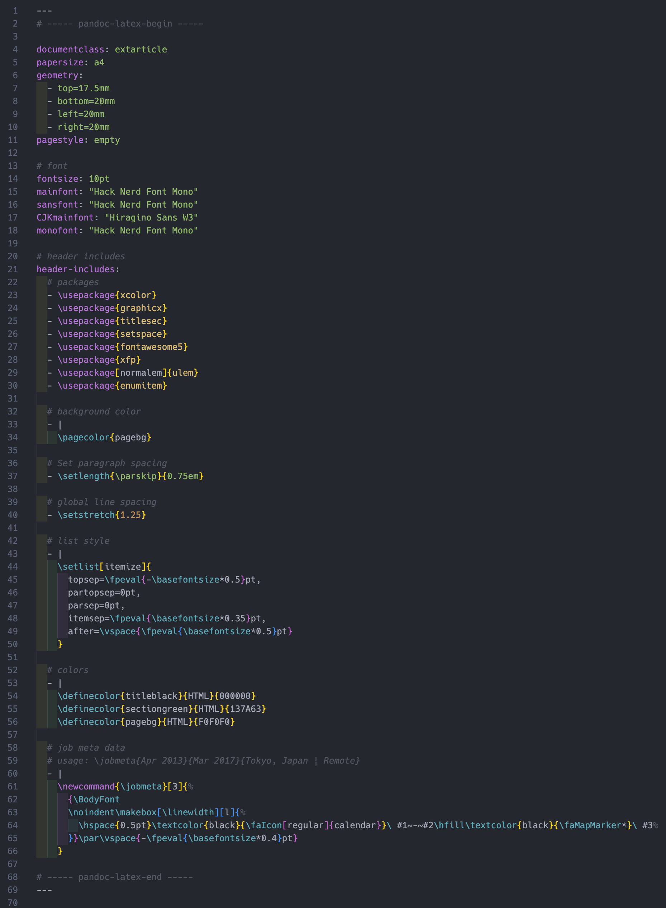
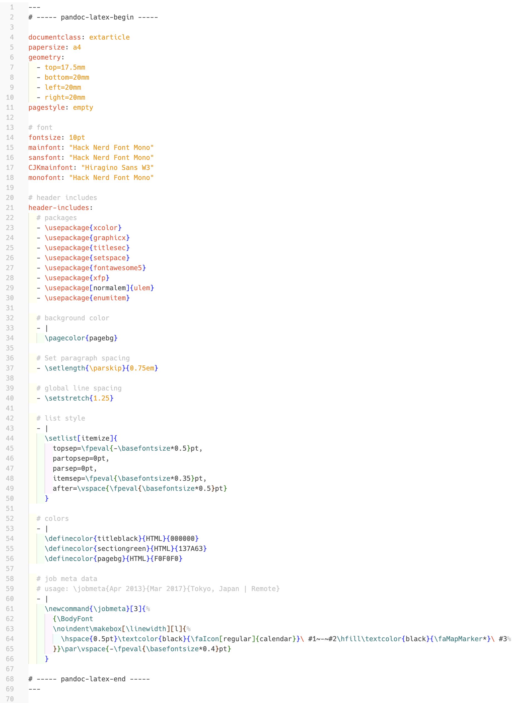
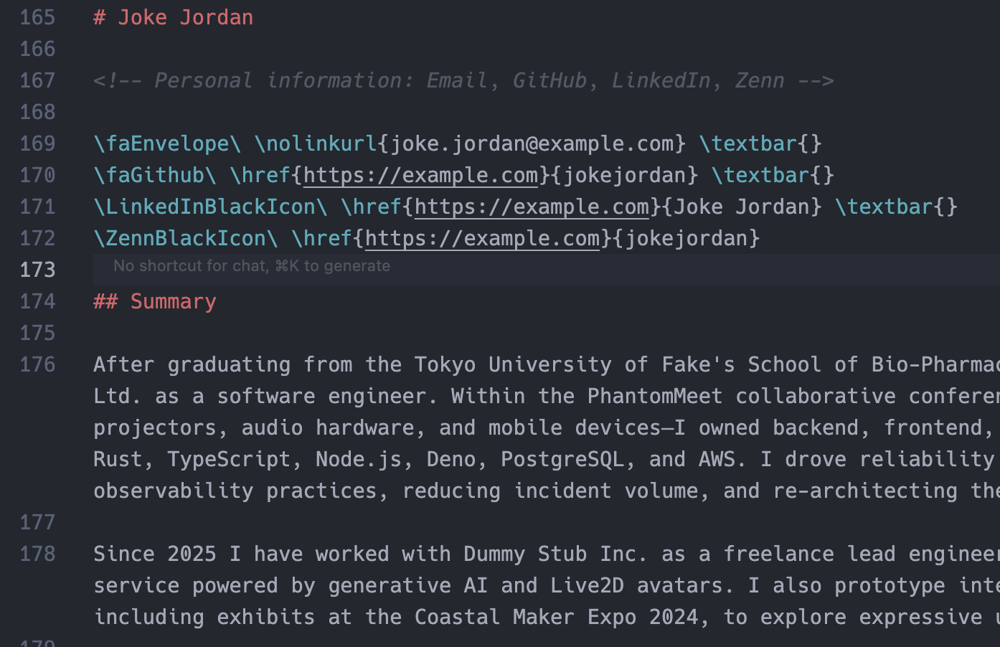
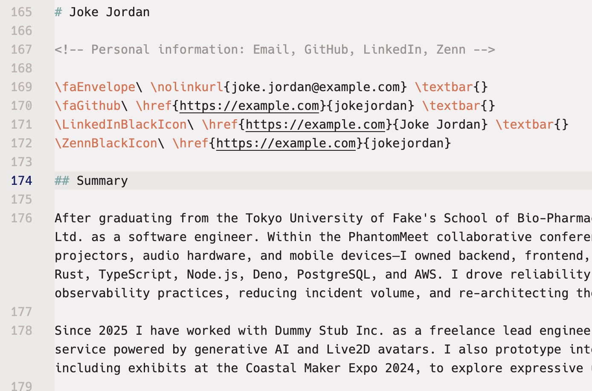
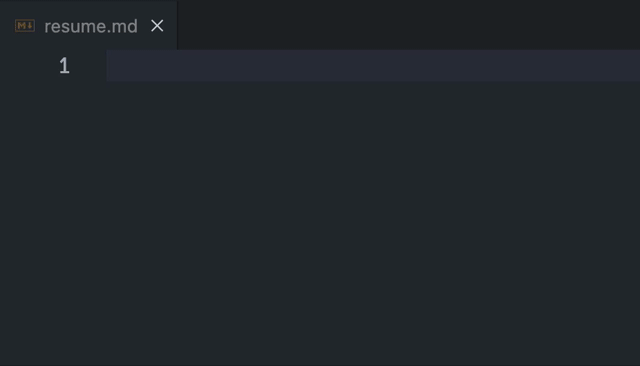
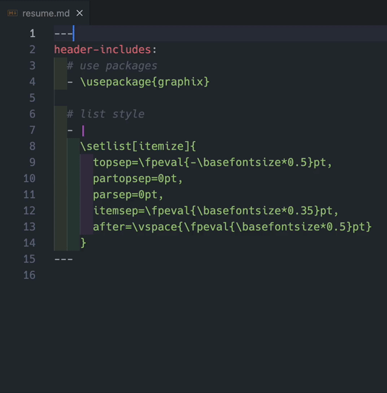

# LaTeX in Markdown for Pandoc

<p align="center">
  
</p>

<p align="center">
  <a href="https://marketplace.visualstudio.com/items?itemName=nukopy.latex-in-markdown-for-pandoc"></a>
  <a href="https://marketplace.visualstudio.com/items?itemName=nukopy.latex-in-markdown-for-pandoc"></a>
  <a href="https://marketplace.visualstudio.com/items?itemName=nukopy.latex-in-markdown-for-pandoc"></a>
  <a href="https://github.com/nukopy/latex-in-markdown-for-pandoc/blob/main/LICENSE"></a>
</p>

<p align="center">
  <a href="#features">Features</a>
  |
  <a href="#installation">Installation</a>
  |
  <a href="#usage">Usage</a>
  |
  <a href="#showcase">Showcase</a>
</p>

Visual Studio Code extension that brings LaTeX syntax highlighting to Markdown documents processed with [Pandoc](https://pandoc.org/index.html).

## Features

LaTeX code in both the Markdown frontmatter and body will be highlighted with this extension.

You can keep using your favorite theme. Features are shown below:

- Highlight LaTeX syntax in Markdown for Pandoc
  - LaTeX in Markdown frontmatter written in YAML
  - LaTeX in Markdown body

### Frontmatter highlight

Frontmatter highlight in dark theme ([Atom One Dark](https://vscodethemes.com/e/akamud.vscode-theme-onedark/atom-one-dark)):



Frontmatter highlight in light theme ([Bold Light (rainglow)](https://vscodethemes.com/e/daylerees.rainglow/bold-light-rainglow)):



### Body highlight

Body highlight in dark theme:



Body highlight in light theme:



## Installation

This extension is available for free in the [Visual Studio Code Marketplace](https://marketplace.visualstudio.com/items?itemName=nukopy.latex-in-markdown-for-pandoc).

If you're Cursor user, you cannot install this extension from the marketplace now (planned to be supported in the future).

However, you can install it from `.vsix` file. See the section [Install locally](#install-locally) for details.

## Usage

### Body highlight

Once the installation is complete, LaTeX code written in the Markdown body will be highlighted with no configuration like [example](#body-highlight).

### Frontmatter highlight

However, one more step is required to **enable highlighting LaTeX in the frontmatter** like [example](#frontmatter-highlight).

LaTeX syntax highlight in the frontmatter is enabled by adding the following 2 lines of YAML comments at the beginning and end of the frontmatter of a Pandoc-flavoured Markdown file.

- `# ----- pandoc-latex-begin -----`
- `# ----- pandoc-latex-end -----`

After adding these comments, the range between them in frontmatter is highlighted as LaTeX code. **This is a necessary step to enable LaTeX syntax highlight in the frontmatter**. We provide [utility snippets](#utility-snippets) to easily add these comments.

If correctly set up, LaTeX code, such as `\usepackage{graphicx}`, in the frontmatter is highlighted in your editor.

Markdown frontmatter should look like the following:

```yaml
---
# ----- pandoc-latex-begin -----

# The code below is treated as normal YAML
documentclass: extarticle
papersize: a4
pagestyle: empty
geometry:
  - top=17.5mm
  - bottom=20mm
  - left=20mm
  - right=20mm

# The code below is highlighted as LaTeX code in your editor!
header-includes:
  - \usepackage{xcolor}
  - \usepackage{graphicx}
  - \usepackage{titlesec}
  - \usepackage{setspace}

# ----- pandoc-latex-end -----
--- # <- punctuation to end frontmatter
```

### Utility snippets

This extension provides utility snippets to easily add the comments mentioned above.

#### for new empty Markdown file

You can add frontmatter template by typing `pandoc template` like below:



#### for existing frontmatter

You can add frontmatter comments that trigger the highlighting by typing `pandoc begin` and `pandoc end`. **You must type these inside the frontmatter block.**



> [!WARNING]
> You might think LaTeX code will still be highlighted even if you skip adding the end comment `# ----- pandoc-latex-end -----` to the frontmatter.
>
> However, this extension depends on those comments to delimit the scope it highlights, so omitting them can lead to unexpected errors. Make sure you add the `# ----- pandoc-latex-end -----` comment to the end of the frontmatter correctly.

## Showcase

TODO: examples の .md, .tex, .pdf のセットを 2 つ。
TODO: single columns の resume と multi columns の resume。

## Roadmap

- [x] 1. Highlight LaTeX syntax in Markdown
  - [x] LaTeX in Markdown frontmatter written in YAML
  - [x] LaTeX in Markdown body
- [ ] 2. Extend LSP support to LaTeX code in Markdown (hover documentation and go-to-definition) or LaTeX Workshop integration.
  - [ ] LaTeX in Markdown frontmatter written in YAML
  - [ ] LaTeX in Markdown body

## Motivation

I built this extension while writing my resume with Pandoc.

I needed proper LaTeX syntax highlighting inside Markdown, both in YAML frontmatter and the body.

## Development

### Requirements

- Node.js v22.16.x
- Visual Studio Code v1.99.x or later
- (optional) Cursor 1.7.x or later

### Setup

```sh
git clone git@github.com:nukopy/latex-in-markdown-for-pandoc.git
cd latex-in-markdown-for-pandoc
pnpm i
```

Now, you can start developing the extension.

### Build

```sh
pnpm run build
```

If successful, the extension package `dist/latex-in-markdown-for-pandoc-<version>.vsix` is created.

### Install locally

Execute command `Extensions: Install from VSIX...` in VS Code (or Cursor) and select the file `dist/latex-in-markdown-for-pandoc-<version>.vsix`.

### Prepare for publishing

1. Create [Azure DevOps organization](https://learn.microsoft.com/en-us/azure/devops/organizations/accounts/create-organization?view=azure-devops)
2. Create [Personal Access Token](https://learn.microsoft.com/en-us/azure/devops/organizations/accounts/use-personal-access-tokens-to-authenticate?view=azure-devops&tabs=Windows)
   - Copy the Personal Access Token for next step
3. Create a [publisher](https://code.visualstudio.com/api/working-with-extensions/publishing-extension#create-a-publisher)

ref: [Publishing Extensions | Visual Studio Code](https://code.visualstudio.com/api/working-with-extensions/publishing-extension)

### Publish to VS Code Marketplace

- Login to VS Code Marketplace

```sh
pnpm run login -- <publisher ID>
# input Personal Access Token
```

- Edit version in `package.json`

```diff json
{
-  "version": "0.1.0"
+  "version": "0.1.1"
}
```

- Release

```sh
pnpm run publish
```

- Unpublish

```sh
pnpm run unpublish
```

## References

Thanks to the following references for inspiration:

- [Pandoc User's Guide — YAML metadata blocks and `header-includes`](https://pandoc.org/MANUAL.html#metadata-blocks)
- [Pandoc User's Guide — Variables](https://pandoc.org/MANUAL.html#variables)
- [Pandoc User's Guide — raw attribute extension (`{=latex}`)](https://pandoc.org/MANUAL.html#extension-raw_attribute)
- [Visual Studio Code Extension API — Syntax Highlight Guide (Injection Grammars)](https://code.visualstudio.com/api/language-extensions/syntax-highlight-guide#injection-grammars)
- [vscode-latex-basics/markdown-latex-combined.tmLanguage.json](https://github.com/jlelong/vscode-latex-basics/blob/main/syntaxes/markdown-latex-combined.tmLanguage.json)

## License

LaTeX in Markdown for Pandoc is under the MIT License: See [LICENSE](./LICENSE) file.
