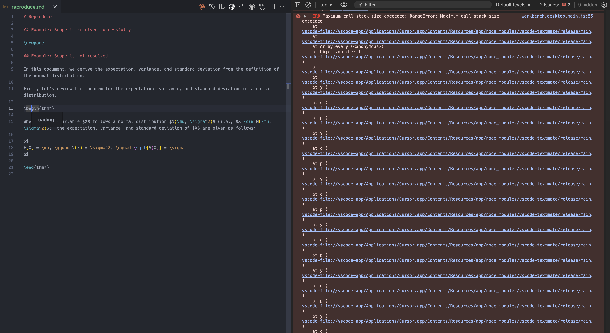

# Fix Issue #3

## Issue

- [[bugfix] ERR Maximum call stack size exceeded: RangeError: Maximum call stack size exceeded](https://github.com/nukopy/latex-in-markdown-for-pandoc/issues/3)

## Pull Request

- https://github.com/nukopy/latex-in-markdown-for-pandoc/pull/5

## How to Reproduce

### Environment

- OS: macOS Sonoma 14.7
- VSCode: 1.99.3 (Cursor 1.7.33)

### Procedure

<!-- この issue を再現させるための全体の流れは以下のとおりです。 -->

To reproduce this issue, you need to do the following steps":

1. Set configurations for the extension
2. Load this extension in VSCode (or Cursor)
3. Open the file `reproduce.md` in your editor
4. Open command palette by `Cmd + Shift + P` and execute `Developer: Inspect Editor Tokens and Scopes`
5. Hover over the text `\begin{thm*}` in [reproduce.md](./docs/reproduce.md) and check the scope, you will see the error that the scope of this token is not resolved and the editor is slow down.
6. In the developer tools in VSCode, you will see the error that `Maximum call stack size exceeded` (see full error log in [reproduced-error-log.txt](./reproduced-error-log.txt))

---

Step-by-step procedure to reproduce this issue is as follows:

To reproduce this issue, at first, set configurations as follows:

- grammar settings in `package.json`

```json
{
  ...,
  "contributes": {
    "grammars": [
      ...,
      {
        "scopeName": "pandoc-latex-injection-body",
        "path": "./syntaxes/pandoc-latex-injection-body.tmLanguage.json",
        "injectTo": [
          "text.html.markdown"
        ]
      }
    ],
  },
  ...
}
```

- `syntaxes/pandoc-latex-injection-body.tmLanguage.json`

```json
{
    "scopeName": "pandoc-latex-injection-body",
    "injectionSelector": "L:meta.paragraph.markdown",
    "patterns": [
        {
            "include": "#latex-injection"
        }
    ],
    "repository": {
        "latex-injection": {
            "name": "meta.embedded.block.body.pandoc-latex-injection",
            "patterns": [
                {
                    "include": "text.tex.latex"
                }
            ]
        }
    }
}
```

Then, load this extension in VSCode and open the file [reproduce.md](./docs/reproduce.md) in your editor.

Next, open command palette by `Cmd + Shift + P` and execute `Developer: Inspect Editor Tokens and Scopes` and enable developer tools.

At last, hover over the text `\begin{thm*}` in [reproduce.md](./docs/reproduce.md) and check the scope, you will see the error that the scope of this token is not resolved and the editor is slow down.

The error is like this:



## Testing

TODO:
